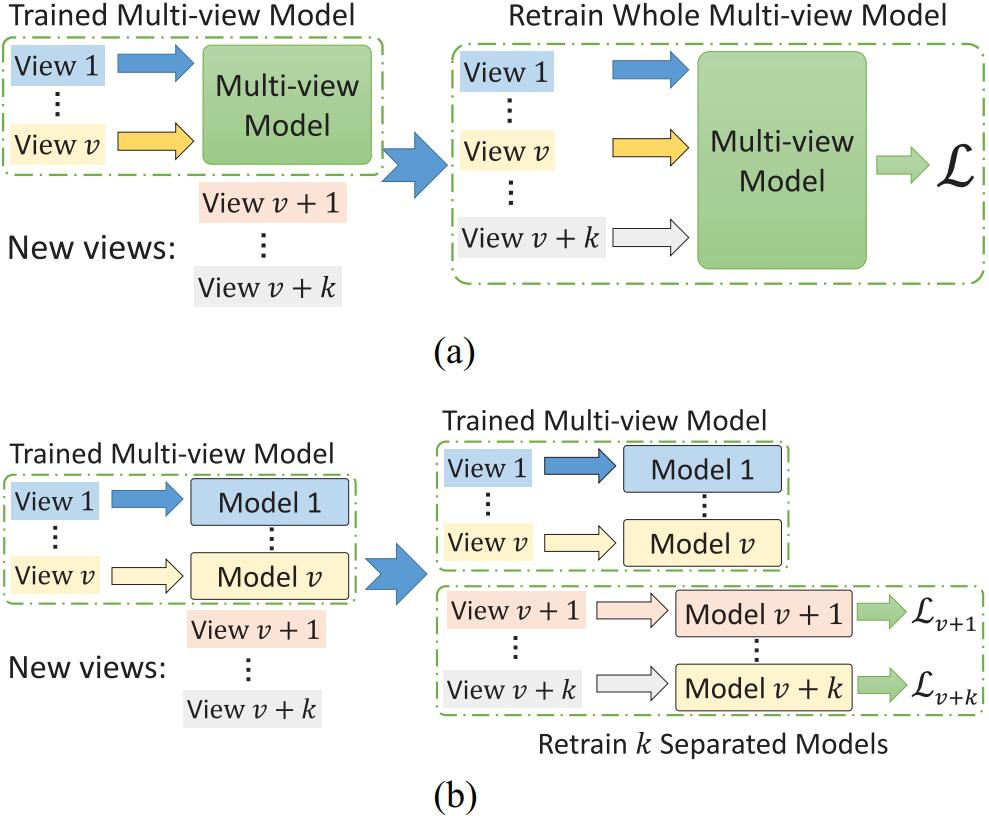

# Deep Semisupervised Multiview Learning With Increasing Views (ISVN, IEEE TCYB)
Peng Hu, Xi Peng, Hongyuan Zhu, Liangli Zhen, Jie Lin, Huaibai Yan, Dezhong Peng, [Deep Semisupervised Multiview Learning With Increasing Views](http://doi.org/10.1109/TCYB.2021.3093626)[J]. IEEE Transactions on Cybernetics, vol. 52, no. 12, pp. 12954-12965, Dec. 2022, doi: 10.1109/TCYB.2021.3093626. (PyTorch Code)

## Abstract
In this article, we study two challenging problems in semisupervised cross-view learning. On the one hand, most existing methods assume that the samples in all views have a pairwise relationship, that is, it is necessary to capture or establish the correspondence of different views at the sample level. Such an assumption is easily isolated even in the semisupervised setting wherein only a few samples have labels that could be used to establish the correspondence. On the other hand, almost all existing multiview methods, including semisupervised ones, usually train a model using a fixed dataset, which cannot handle the data of increasing views. In practice, the view number will increase when new sensors are deployed. To address the above two challenges, we propose a novel method that employs multiple independent semisupervised view-specific networks (ISVNs) to learn representation for multiple views in a view-decoupling fashion. The advantages of our method are two-fold. Thanks to our specifically designed autoencoder and pseudolabel learning paradigm, our method shows an effective way to utilize both the labeled and unlabeled data while relaxing the data assumption of the pairwise relationship, that is, correspondence. Furthermore, with our view decoupling strategy, the proposed ISVNs could be separately trained, thus efficiently handling the data of increasing views without retraining the entire model. To the best of our knowledge, our ISVN could be one of the first attempts to make handling increasing views in the semisupervised setting possible, as well as an effective solution to the noncorresponding problem. To verify the effectiveness and efficiency of our method, we conduct comprehensive experiments by comparing 13 state-of-the-art approaches on four multiview datasets in terms of retrieval and classification.

## Framework
<h4>Figure 1. Difference between (a) existing joint multiview learning and (b) our independent multiview learning. In brief, the traditional methods use all views to learn the common space. They are difficult to handle increasing views since their models are optimized depending on all views. Thus, they should retrain the whole model to handle new views, which is inefficient with abandoning the trained model. In contrast, our method independently trains the <i>k</i> view-specific models for the <i>k</i> new views, thus efficiently handling increasing views.</h4>
<div align=center></div>


***
<h4>Figure 2. Pipeline of our ISVN for the 𝓲th view. All views could be separately projected into the common space without any interview constraints, and could easily and efficiently handle new views.</h4>
<div align=center></div>


## Usage
To train a model for image modelity wtih 64 bits on $datasets, just run main_DCHN.py as follows:
```bash
python train_ISVN.py --datasets $datasets --epochs $epochs --batch_size $batch_size --view_id $view --output_shape $output_shape --beta $beta --alpha $alpha --threshold $threshold --K $K --gpu_id $gpu_id
```
where <font color=MediumOrchid>$datasets</font>, <font color=MediumOrchid>$epochs</font>, <font color=MediumOrchid>$batch_size</font>, <font color=MediumOrchid>$view</font>, <font color=MediumOrchid>$output_shape</font>, <font color=MediumOrchid>$beta</font>, <font color=MediumOrchid>$alpha</font>, <font color=MediumOrchid>$threshold</font>, <font color=MediumOrchid>$K</font>, and <font face="times" color=MediumOrchid>$gpu_id</font> are the name of dataset, epoch , batch size, view number, objective dimensionality, <i>β</i>, <i>α</i>，<i>γ</i>, the number of labeled data, and GPU ID, respectively.

To evaluate the trained models, you could run train_ISVN.py as follows:
```bash
python train_ISVN.py --mode eval --datasets $datasets --view -1 --output_shape $output_shape --beta $beta --alpha $alpha --K $K --gpu_id $gpu_id --num_workers 0
```

## Comparison with the State-of-the-Art

<h4>Table 1. Performance comparison in terms of mAP scores on the XMediaNet dataset. The highest score is shown in <b>boldface</b>.</h4>

  
***

<h4>Table 2. Performance comparison in terms of mAP scores on the NUS-WIDE dataset. The highest score is shown in <b>boldface</b>.</h4>

***

<h4>Table 3. Performance comparison in terms of mAP scores on the INRIA-Websearch dataset. The highest score is shown in <b>boldface</b>.</h4>

***

<h4>Table 4. Performance comparison in terms of cross-view top-1 classification on the MNIST-SVHN dataset. The highest score is shown in <b>boldface</b>.</h4>

***

<h4>Table 5. Ablation study on different datasets. <s>X</s> denotes training ISVN without X, and X could be autoencoder (AE) and pseudo-label (PL). This table shows the experimental results of cross-view retrieval on XMediaNet and NUS-WIDE, and of cross-view classification on MNIST-SVHN. The highest score is shown in <b>boldface</b>.</h4>


## Citation
If you find ISVN useful in your research, please consider citing:
```
@inproceedings{hu2021ISVN,
  author={Hu, Peng and Peng, Xi and Zhu, Hongyuan and Zhen, Liangli and Lin, Jie and Yan, Huaibai and Peng, Dezhong},
  journal={IEEE Transactions on Cybernetics}, 
  title={Deep Semisupervised Multiview Learning With Increasing Views}, 
  year={2022},
  volume={52},
  number={12},
  pages={12954-12965},
  doi={10.1109/TCYB.2021.3093626}}
}
```
